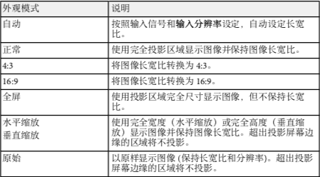

===================
图像长宽比
===================
以不同的长宽比显示图像。通常，视频源的输入信号确定图像的长宽比。但是，您可以更改特定图像的长宽比以适合自己的屏幕。

更改图像长宽比
--------------------
您可以更改所显示图像的长宽比

**注意：**

    更改长宽比之前，在投影机 **扩展设置** 菜单中设定 **屏幕类型** 

    - **扩展设置** > **显示设定** > **屏幕** > **屏幕类型**,仅在**比例模式**设置为**全屏显示**时，此设定可用
    - **信号** > **比例** > **比例模式**

1. 打开投影机并切换至想要使用的图像源

2. 按遥控器上的[Aspect]按钮

    .. image:: images/image3-12-1.png

   显示图像的形状和尺寸会改变，长宽比名称短暂出现在屏幕上。

3. 要循环选择适合您输入信号的长宽比，请重复按[Aspect]按钮

    **注意：**

        要显示不带黑条的图像，请根据计算机的分辨率在信号中将 **输入分辨率** 设为宽屏或正常。

可用的图像长宽比
-------------------
您可以根据所选的屏幕类型设置和图像源中的输入信号，选择以下图像长宽比。

**注意：**

    - 可用长宽比设定取决于输入信号。

    - 请注意，根据版权法，处于商业用途使用投影机的长宽比功能缩小、放大或分割投影的图像可能侵犯该图像版权持有人的版权。

